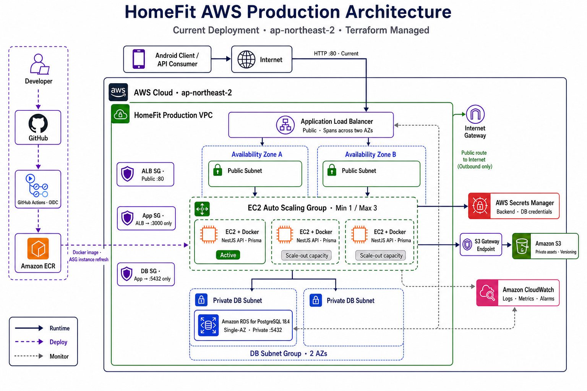
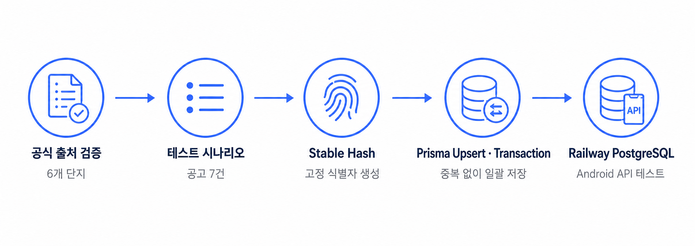

<div align="center">

# 🏠 HomeFit

### “이 집, 내가 실제로 들어갈 수 있을까?”

청년주택 공고와 사용자의 소득·자산·현금 조건을 연결해  
**입주 가능성, 부족 자금, 월세 부담과 금융상품을 한 흐름으로 안내하는 주거·금융 의사결정 서비스**입니다.

[](https://github.com/umc-homefit/backend)
[](https://github.com/umc-homefit/frontend)


**UMC 10th · 2026.06–2026.08 · Completed**

</div>

---

## 🏡 Project

청년주택 공고는 여러 기관에 흩어져 있고, 공고를 찾더라도 자신의 소득·자산·무주택 조건으로 실제 입주가 가능한지 판단하기 어렵습니다. 보증금과 월세를 감당하기 위한 금융상품도 다시 별도로 찾아야 합니다.

HomeFit은 이 과정을 하나의 사용자 흐름으로 연결했습니다.

```text
공고 탐색 → 공고 상세 → 사용자 조건 입력 → 입주 가능성 분석
→ 부족 자금·월세 부담 확인 → 금융상품 확인 → 관심 공고 저장·알림
```

> 분석 결과는 사용자가 입력한 정보와 공고 조건을 기반으로 한 예상 결과이며, 실제 심사 결과와 다를 수 있습니다.

---

## ✨ Core Features

| 기능 | 설명 |
|---|---|
| **공고 탐색** | 지역·모집 상태·면적·보증금 조건으로 청년주택 공고 검색 |
| **공고 상세** | 주택형, 보증금·월세, 자격 조건과 첨부파일 확인 |
| **조건 프로필** | 소득·자산·부채·보유 현금·무주택 여부 등 분석 조건 관리 |
| **입주 가능성 분석** | 조건별 충족 여부, 부족 자금과 월세 부담률 계산 |
| **금융상품 매칭** | 사용자 조건에 따른 정책 주거 금융상품 적격 여부와 탈락 사유 제공 |
| **관심 공고·알림** | 공고 저장, 저장 공고 관리와 공고 관련 알림 제공 |

### 연동 검증 데이터

| 공식 출처 기반 단지 | 연동 공고 | 금융상품 | 테스트 시나리오 |
|:---:|:---:|:---:|:---:|
| **6개** | **7건** | **4개** | **3종** |

---

## 🛠️ Tech Stack

| 분류 | 사용 기술 | 설명 |
|---|---|---|
| **Android** | Kotlin, Jetpack Compose, Material3 | 선언형 UI 및 Android 클라이언트 구현 |
| **Architecture** | MVVM, Hilt | 화면 상태 분리와 의존성 주입 |
| **Networking** | Retrofit, Coroutines, Flow | API 통신과 비동기 데이터 흐름 |
| **Backend** | NestJS, TypeScript, Node.js | 도메인 모듈 기반 REST API 서버 |
| **Database** | PostgreSQL, Prisma | 스키마·Migration·트랜잭션 관리 |
| **Auth / Docs** | JWT, Swagger, Notion | 인증 및 API 계약 관리 |
| **Test** | Jest, Supertest, Testcontainers | 단위·통합·Docker E2E 검증 |
| **MVP Deploy** | Railway | Android 연동을 위한 1차 API·DB 배포 |
| **AWS** | VPC, ALB, EC2 Auto Scaling, RDS, ECR, S3 | 데모 환경의 확장형 인프라 구성 |
| **DevOps** | Terraform, Docker, GitHub Actions OIDC | IaC와 장기 Access Key 없는 CI/CD |
| **Operations** | Secrets Manager, CloudWatch | 환경변수 보호와 로그·지표·경보 관리 |

---

## 🏗️ Architecture

MVP 단계에서는 Railway로 빠르게 배포해 Android 연동 계약을 검증했습니다. 이후 최종 데모 환경은 Terraform으로 AWS 인프라를 구성하고, GitHub Actions OIDC를 이용해 컨테이너 이미지 배포를 자동화했습니다.

<p align="center">
  
</p>

### 공고 데이터 수집·정규화

공식 출처를 확인한 6개 단지를 기준으로 연동 공고 7건을 구성하고, Stable Hash와 Prisma Upsert를 적용해 Seed를 반복 실행해도 중복되지 않도록 설계했습니다. 공고·주택형·자격조건·첨부파일은 하나의 트랜잭션으로 저장합니다.

<p align="center">
  
</p>

---

## ✅ Integration & Reliability

- 공통 성공·오류 응답, 0-base Pagination, ISO 8601 날짜와 인증 규칙을 API 계약으로 통일
- ERD, Prisma Schema와 Migration을 함께 관리해 DB 제약조건 동기화
- Android 팀과 테스트 계정 3종 및 예상 분석·금융 결과를 사전 합의
- Docker·Testcontainers E2E로 빈 PostgreSQL Migration과 주요 API 흐름 검증
- Railway PostgreSQL 18의 사용자·공고·분석 데이터를 AWS RDS PostgreSQL 18로 이관하고 Migration 이력과 핵심 테이블 건수를 교차 검증
- 최종 스모크 테스트에서 조건 프로필 미입력 예외, 적격·탈락 분석과 금융상품 매칭 흐름 확인

---

## 🏆 Highlights

<div align="center">

### Backend Team Lead 김찬혁 · UMC 10th 베스트 챌린저 선정

**2026년 8월 22일 부산 BEXCO 데모데이에서 방문자 대상 서비스를 운영했습니다.**  
Android 앱의 로그인부터 공고 탐색, 입주 가능성 분석, 금융상품 확인까지 전체 사용자 흐름을 현장에서 검증했습니다.

</div>

---

## 👥 Team

### Backend

| 이름 | 담당 |
|---|---|
| **찬찬 / 김찬혁** | Backend Team Lead · Notice · DB · Infra |
| **주드 / 박주완** | Auth · User · Notification |
| **니카 / 이나경** | Eligibility Analysis |
| **이든 / 정지훈** | Finance · Guide |

### Android

| 이름 | 담당 |
|---|---|
| **릴리 / 김혜민** | Android |
| **제이 / 박유진** | Android |
| **양고 / 전서영** | Android |
| **리비 / 홍지원** | Android |

---

## 🔗 Repositories & Documents

- [HomeFit Backend](https://github.com/umc-homefit/backend)
- [HomeFit Android](https://github.com/umc-homefit/frontend)
- [API Specification](https://app.notion.com/p/api-38e2a03e23d98097aa90e434b9017faa)

---

## 📌 Project Status

HomeFit의 UMC 10th 개발과 데모 운영은 2026년 8월에 종료되었습니다. 데모용 AWS 과금 리소스는 운영 종료 후 회수했으며, 원본 코드와 문서는 위 저장소에서 확인할 수 있습니다.
